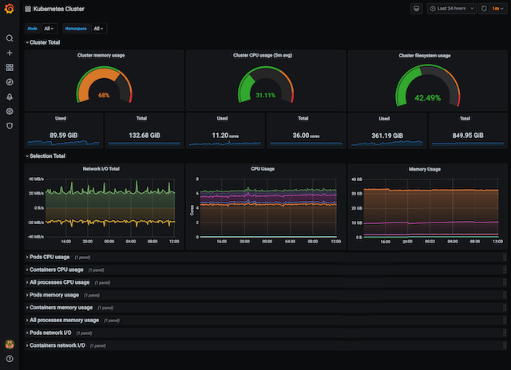
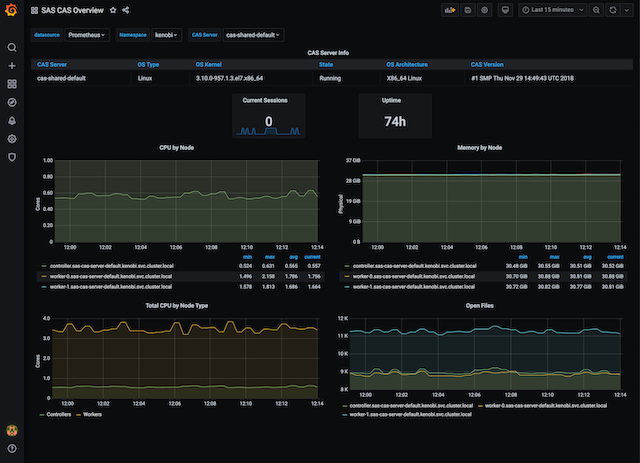
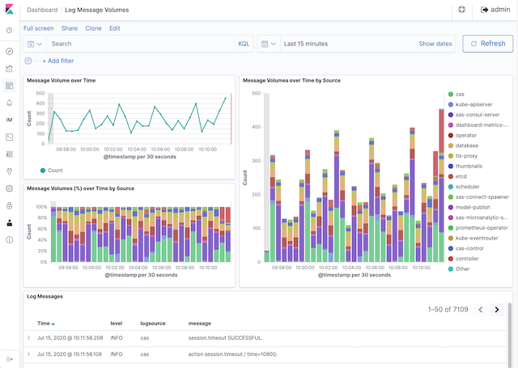

# SAS® Viya® Monitoring for Kubernetes

SAS® Viya® Monitoring for Kubernetes provides simple scripts and customization
options to deploy monitoring, alerts, and log aggregation for SAS Viya 4.x.

Monitoring and logging may be deployed independently or together. There are
no hard dependencies between the two.

## Monitoring - Metrics and Alerts

The monitoring solution includes these components:

- [Prometheus Operator](https://github.com/coreos/prometheus-operator)
  - [Prometheus](https://prometheus.io/docs/introduction/overview/)
  - [Alert Manager](https://prometheus.io/docs/alerting/alertmanager/)
  - [Grafana](https://grafana.com/)
- Prometheus Exporters
  - [node-exporter](https://github.com/prometheus/node_exporter)
  - [kube-state-metrics](https://github.com/kubernetes/kube-state-metrics)
  - [Prometheus Adapter for Kubernetes Metrics APIs](https://github.com/DirectXMan12/k8s-prometheus-adapter)
  - [Prometheus Pushgateway](https://github.com/prometheus/pushgateway)
- Alert definitions
- Grafana dashboards
  - Kubernetes cluster monitoring
  - SAS CAS Overview
  - SAS Java Services
  - SAS Go Services
  - RabbitMQ
  - Postgres
  - Fluent Bit
  - Elasticsearch
  - Istio
  - NGINX

This is an example of a Grafana dashboard for cluster monitoring.


This is an example of a Grafana dashboard for SAS CAS monitoring.


## Logging - Aggregation, Searching, & Filtering

The logging solution includes these components:

- [Fluent Bit](https://fluentbit.io/)
  - Custom Fluent Bit parsers
- [Elasticsearch](https://www.elastic.co/products/elasticsearch)
  - Custom index pattern for logs
  - Namespace separation
  - [Elasticsearch Exporter](https://github.com/helm/charts/tree/master/stable/elasticsearch-exporter)
- [Kibana](https://www.elastic.co/products/kibana)
  - Custom Kibana dashboards

  This is an example of a Kibana dashboard displaying log message volumes.

  

## Prerequisites

- A Kubernetes cluster that meets the prerequisites for SAS Viya
- [Helm](https://helm.sh) (version 3.x recommended)
- `kubectl` with cluster-admin access

### Helm

[Helm](https://helm.sh) 2.x and 3.x are both supported. The scripts
should auto-detect the Helm version on the `PATH`.

**NOTE:** You cannot use Helm 3.x to upgrade a monitoring or logging
deployment that you originally installed with Helm 2.x. You must use
the original Helm 2.x version to remove the monitoring or logging
deployment and then use the new Helm 3.x version for a fresh deployment.

#### Recommendation: Use Helm 3.x if possible

Although both Helm 2.x and Helm 3.x are currently supported, Helm 3.x is
recommended.

If you are using Helm 2.x, run `helm init --upgrade` to make sure your
local Helm version matches the version of Tiller in your cluster. Helm 3.x
does not require Tiller or a `helm init` command.

You can safely ignore the `NOTES` sections that you see when a Helm chart
deploys successfully.

## Installation

### Monitoring

See the [monitoring README](monitoring/README.md) to deploy the monitoring
components, including Prometheus Operator, Prometheus, Alert Manager, Grafana,
metric exporters, service monitors, and custom dashboards.

### Logging

See the [logging README](logging/README.md) to deploy the logging components,
including Fluent Bit, Elasticsearch, and Kibana.

## Miscellaneous

### Customization

The components that are deployed are highly customizable. The recommended approach for customization is
to set a `USER_DIR` environment variable. `USER_DIR` points to a directory
containing user-modified customization files which can exist outside of your repository.
You can use customization files to check in environment-specific customizations into a separate Git repository, for example.

`USER_DIR` must refer to a directory. The directory can include any or all of
the following files in the structure below. Additional content is allowed, but
will be ignored.

```text
- user.env
- [monitoring]
  - user.env
  - user-values-prom-operator.yaml
  - user-values-pushgateway.yaml
- [logging]
  - user.env
  - user-values-elasticsearch-open.yaml
  - user-values-es-exporter.yaml
  - user-values-fluent-bit-open.yaml
```

### Default StorageClass

The default cluster StorageClass is used for both monitoring and logging
unless the value is specifically set in `user-*.yaml` files for monitoring or logging. The
deployment scripts issue a warning if no default StorageClass is
available, even if the value is properly set by the user. In this case,
you can safely ignore the warning.
